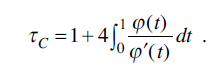

```{r, echo=FALSE, message=FALSE}

require(pacman)

p_load(PerformanceAnalytics, fExtremes, evd, VGAM, kableExtra, DT, extremis, copula, evmix, ismev, 
       extRemes, knitr, stabledist, StableEstim, fBasics, lubridate, tidyverse)

```

```{r, echo=FALSE}
## leitura dos dados
if (length(args) > 1){
  pasta_raiz = args[1]
}else{
  pasta_raiz = dirname(rstudioapi::getSourceEditorContext()$path)
}

setwd(paste0(pasta_raiz,"./../data/raw"))


russell <- read.csv("RUT.csv", encoding = "UTF-8")
msci <- read.csv("ECNS - Dados Históricos.csv", encoding = "UTF-8")
```


## Introdução

- No mercado financeiro, os índices servem como referências do comportamento da economia.
- Eles ainda podem ser direcionados a grupos de empresas com certas características, tais como:

## Introdução

- S&P 500 - 500 maiores empresas de capital aberto dos Estados Unidos


## Introdução

- Ibovespa -  Carteira teórica de ações composta por 65 ações de 61 empresas. Esses ativos são aqueles que possuem maior volume de negociação na B3.


## Introdução

- Índices com outras características;
- Pequenas empresas (small caps), tais como:
  - Russell 2000 (EUA);
- Índices de outras regiões do mundo:  
  - MSCI (Emerging Markets);


## Índice Russell 2000 (EUA)

- O Índice Russell 2000 mede o desempenho de aproximadamente 2.000 empresas de pequena capitalização no Índice Russell 3000, este composto por 3.000 das maiores ações dos EUA;

- Dados do Yahoo Finance;

- Período: 06/02/2018 a 05/02/2021;

```{r, echo=FALSE}
## RUSSELL - criando variavel de logretorno (serao utilizados como padrao o logretorno)
russell$retorno <- russell$High/dplyr::lag(russell$High)
russell$logretorno <- log(russell$retorno)
russell$logretorno <- ifelse(is.na(russell$logretorno),0, russell$logretorno)

```

```{r, echo=FALSE}
## RUSSELL - selecionando as variaveis de estudo
logret_rus <- russell$logretorno
ret_rus <- russell$retorno
High_rus <- russell$High
```


## Índice MSCI (Emerging Markets)

- Medida do desempenho do mercado de ações em uma determinada área ou representando um conjunto de ações globais que, juntas, apresentam uma característica em específico.

- **MSCI World** O índice mundial da MSCI mede o desempenho do mercado de empresas de grande e médio porte com presença global e em países desenvolvidos;

- **MSCI ACWI** Ações de grande e médio porte do mundo, em 23 mercados desenvolvidos e 26 emergentes;

- **MSCI Brazil** acompanha o desempenho de grandes e médias empresas brasileiras;

## Índice MSCI (Emerging Markets)

- **MSCI Emerging Markets** Índice que acompanha o desempenho das bolsas de valores de 26 países emergentes;

 Argentina, **Brasil**, Chile, **China**, Colômbia, República Tcheca, Egito, Grécia, Hungria, Índia , Indonésia, Coréia, Malásia, México , Paquistão, Peru, Filipinas, Polônia, Catar, Rússia, Arábia Saudita, África do Sul, Taiwan, Tailândia, Turquia e Emirados Árabes Unidos

- Dados do Yahoo Finance;

- Período: 06/02/2018 a 05/02/2021;

```{r, echo=FALSE}
## MSCI - criando variavel de logretorno (serao utilizados como padrao o logretorno) 
msci$retorno <- msci$High/dplyr::lag(msci$High)
msci$logretorno <- log(msci$retorno)
msci$logretorno <- ifelse(is.na(msci$logretorno),0, msci$logretorno)
```


```{r, echo=FALSE}
## MSCI - selecionando as variaveis de estudo
logret_msci <- msci$logretorno
ret_msci <- msci$retorno
High_msci <- msci$High

```

## Resultados

- Valores reais:
```{r, echo=FALSE, fig.height=6}
# grafico dos valores reais
par(mfrow= c(1,2))
plot(High_rus, type = "l")
plot(High_msci, type = "l")
```

## Resultados

- Grande volatilidade;
- Interesse em mínimos e em máximos dos dados;
- Valores encontrados nas caldas das distribuições;
- distribuições que apresentam maior sensibilidade em modelar dados na cauda são mais adequadas nesses casos (GEV).

## Resultados

- Comumente, trabalha-se com os logretornos, variável que será objeto de análise;

$$ logretonros = log\big(\frac{R_t}{R_{t-1}}\big) $$


## Resultados

```{r, echo=FALSE, fig.height=6}
# grafico dos logretornos
par(mfrow= c(1,2))
data_rus <- as.Date(russell$Date)
plot(data_rus,logret_rus, type = "l", ylab = "Logretornos", xlab = "Tempo",
     main = "Logretonos diários do\nÍndice Russell 2000 (EUA), 2018-2021")
data_msci <- as.Date(msci$Date)
plot(data_msci,logret_msci, type = "l", ylab = "Logretornos", xlab = "Tempo",
     main = "Logretonos diários do\nÍndice MSCI (Emerging Markets), 2018-2021")

```


## Resultados
```{r, echo=FALSE, warning=FALSE, fig.height=6}

## histograma dos dados com normal

par(mfrow = c(1,2))
x <- logret_rus
hist_dados<-hist(x,n=50,breaks = 30, prob=T,ylim=c(0,50),main = "Histograma dos logretornos - Russell 2000, EUA", ylab = "Densidade",xlab="Logretorno")
lines(seq(min(x,na.rm=T),max(x,na.rm=T),length=1000),
      dnorm(seq(min(x,na.rm=T),max(x,na.rm=T),
                length=1000),mean(x,na.rm=T),sd(x,na.rm=T)),lwd=2)

y <- logret_msci
hist_dados<-hist(y,n=50,breaks = 30, prob=T,ylim=c(0,50),main = "Histograma dos logretornos - MSCI, \nEmerging Markets", ylab = "Densidade",xlab="Logretorno")
lines(seq(min(x,na.rm=T),max(x,na.rm=T),length=1000),
      dnorm(seq(min(x,na.rm=T),max(x,na.rm=T),
                length=1000),mean(x,na.rm=T),sd(x,na.rm=T)),lwd=2)

```


## Resultados

Tabela com medidas resumo dos logretornos dos índices:

```{r, echo=FALSE}
# tabelas de medidas resumo

media_r <- mean(logret_rus)
varianc_r <- var(logret_rus)
dp_r <- sqrt(varianc_r)
indice_r <- "Russell 2000"
df_r <- data.frame(indice_r, media_r, varianc_r, dp_r)

media_m <- mean(logret_msci)
varianc_m <- var(logret_msci)
dp_m <- sqrt(varianc_m)
indice_m <- "MSCI"
df_m <- data.frame(indice_m, media_m, varianc_m, dp_m)
names(df_m) <- names(df_r)

df_final <- rbind(df_r, df_m)
names(df_final) <- c("Índice", "Média", "Variância", "Desvio padrão")
kable(df_final) %>%
 kable_styling(bootstrap_options = c("striped", "hover"))

```

## Blocos máximos

- Tamanho "ótimo" de $N$ é dado quandos os dados forem independentes;

- Objetivo é ajustar $M_T$ de forma que $M_T \sim GEV$


## Blocos máximos - Russell


```{r, echo = FALSE, warning=FALSE, message=FALSE}
ret <- logret_rus
N<-length(ret) 
result <- data.frame() 

for (k in 1:50) {
  
  # calculando blocos maximos
  n<-k
  tau<-floor(N/n)
  m<-numeric(tau) ; j<-1
  for (i in 1:tau){
    m[i]<-max(ret[j:(j+n-1)])
    j<-j+n }
  m<-m[-1]
  
  # aplicando o teste de hipotese na k-ésima observacao
  teste<-Box.test(m, lag = 1, 
                  type = c("Box-Pierce", "Ljung-Box"), 
                  fitdf = 0)
  teste$indice <- k
  
  # salvando apenas variaveis de interesse
  teste <- c(teste$indice,teste$p.value)
  
    #verificando se a k-ésima variavel foi nao-rejeitada
  if(teste[2]>0.05){
  
    result <- rbind(result, teste)
    
  }

  #print(k)
}


```

```{r, echo=FALSE}
#result <- tibble(result)
names(result) <- c("Tamanho do bloco","P-valor (teste de Ljung-Box)")
# 37 
kable(result) %>%
 kable_styling(bootstrap_options = c("striped", "hover"))
```


```{r, echo=FALSE}
ret <- russell$logretorno
N <- length(ret) ; n <- 37 # tamanho do bloco
tau <- floor(N/n) # numero de blocos = 20
m <- numeric(tau) ; j<-1
for (i in 1:tau){
  m[i]<-max(ret[j:(j+n-1)])
  j<-j+n }
m<-m[-1]

m_rus <- m

```

## Blocos máximos - Russell 2000

 - Blocos com tamanho de 37 dias;
 - P-valor: 0.0574529
```{r, echo=FALSE}
plot.new() 
par(mfrow=c(1,2))
{hist(m_rus, prob=T,
      ylim=c(0,60), 
      main = "Histograma dos máximos dos\nblocos de 37 dias da cotação\ndo Russell 2000 (EUA)",
      ylab = "Densidade",xlab = "Logretornos")
  lines(density(m_rus))}
plot(m_rus, type="l",main="Valores máximos do Índice Russell 2000 (EUA)", ylab="Logretornos") #Some extremes

```


## Blocos máximos - MSCI (Emerging Markets)

 - Blocos com tamanho de 37 dias;
 
```{r, echo=FALSE}
## blocos maximos msci

ret_m <- msci$logretorno
N <- length(ret_m) ; n <- 37 # tamanho do bloco
tau <- floor(N/n) # numero de blocos = 20
m <- numeric(tau) ; j<-1
for (i in 1:tau){
  m[i]<-max(ret_m[j:(j+n-1)])
  j<-j+n }
m<-m[-1]

m_msci <- m
```


```{r, echo=FALSE}
#plot.new() 
par(mfrow=c(1,2))
{hist(m_msci, 
      prob=T,
      ylim=c(0,60),
      main = "Histograma dos máximos dos\nblocos de 10 dias da cotação\ndo MSCI (China)",
      ylab = "Densidade",xlab = "Logretornos")
  lines(density(m_msci))}
plot(m_msci, type="l",main="Valores máximos do Índice MSCI (China)", ylab="Logretornos") #Some extremes

```

## Estimação por máxima verossimilhança da GEV

Os parâmetros $\mu$, $\xi$ e $\sigma$ foram estimados por máxima verossimilhança, utilizando a função _fevd_ do pacote _Extrems_ do _softwere_ R.

```{r, echo=FALSE}
# russell

fit_rus <- fevd(m_rus,type="GEV")
par_gev_r<- as.data.frame(fit_rus$results$par)#positive shape estimate but 
par_gev_r$parametros <- c("mu","sigma","csi")
row.names(par_gev_r) <- NULL

par_gev_r$parametros <- factor(par_gev_r$parametros, 
                             levels=c("csi","mu","sigma"))
par_gev_r <- par_gev_r[order(par_gev_r$parametros),]
par_gev_r <- par_gev_r[,c(2,1)]
row.names(par_gev_r) <- NULL
names(par_gev_r) <- c("Parâmetros","Russell")

# msci

fit_msci <- fevd(m_msci,type="GEV")
par_gev_m<- as.data.frame(fit_msci$results$par)#positive shape estimate but 
par_gev_m$parametros <- c("mu","sigma","csi")
row.names(par_gev_m) <- NULL
par_gev_m$parametros <- factor(par_gev_m$parametros, 
                               levels=c("csi","mu","sigma"))
par_gev_m <- par_gev_m[order(par_gev_m$parametros),]
par_gev_m <- par_gev_m[,c(2,1)]
row.names(par_gev_m) <- NULL
names(par_gev_m) <- c("Parâmetros","MSCI")

par_gev_final <- merge(par_gev_r, par_gev_m, by="Parâmetros")

kable(par_gev_final) %>%
 kable_styling(bootstrap_options = c("striped", "hover"))

```


## Ajuste Russell 2000

```{r, echo=FALSE}
plot(fit_rus)
```


## Ajuste MSCI

```{r, echo=FALSE}
plot(fit_msci)
```


```{r, echo=FALSE}
# guardando resultados
mu_r <- par_gev_r$Russell[par_gev_r$Parâmetros == "mu"]
sigma_r <- par_gev_r$Russell[par_gev_r$Parâmetros == "sigma"]
csi_r <- par_gev_r$Russell[par_gev_r$Parâmetros == "csi"]

# guardando resultados
mu_m <- par_gev_m$MSCI[par_gev_m$Parâmetros == "mu"]
sigma_m <- par_gev_m$MSCI[par_gev_m$Parâmetros == "sigma"]
csi_m <- par_gev_m$MSCI[par_gev_m$Parâmetros == "csi"]
```


## Histograma com dados silumados versus dados reais

```{r, echo=FALSE}
set.seed(2)
n <- 100

# uniforme
y <- runif(n,min=0,max=1)

amostra_r <- mu_r - (sigma_r/csi_r)*(1-(-log(y))^(csi_r))
amostra_m <- mu_m - (sigma_m/csi_m)*(1-(-log(y))^(csi_m))
```


```{r, echo=FALSE}
gev.padrao <- function(y,csi){
  
  if (csi!=0){
    # essa é a densidade da gev padrao quando csi != 0 (derivada da FDA)
    y <- (((1+(csi*(y)))^((-1/csi)-1))*(exp(-(1+(csi*y))^(-1/csi))))
  }else{
    # densidade da gev padrao quando csi = 0
    y <- exp(-y-exp(-y))
  }
  return(y)
}


gev. <-function(y,csi,s,mu){
  
  y <- (gev.padrao(((y-mu)/s),csi))/s
  
  return(y)
}

```

```{r, echo=FALSE}
par(mfrow = c(1,2))
#x11()
hist(amostra_r, prob = T, border = "grey51", breaks = 5, ylim = c(0,70),
     col = "lightblue", main="", xlab="Amostra", ylab= "Densidade")
curve(gev.(x,csi=csi_r, s=sigma_r ,mu=mu_r ), add= T, col = 'black')


hist(amostra_m, prob = T, border = "grey51",breaks = 5,ylim = c(0,70),
     col = "lightblue", main="", xlab="Amostra", ylab= "Densidade")
curve(gev.(x,csi=csi_m, s=sigma_m ,mu=mu_m ), add= T, col = 'black')

```

## VaR Russell

```{r, echo=FALSE}

# estimativas var  gev - verificar

# v1_r <- varpp(logret_rus, mu_r, 0.9, sigma_r, csi_r)
# v12_r <- varpp(logret_rus,mu_r, 0.95, sigma_r,csi_r)
# v13_r <- varpp(logret_rus,mu_r, 0.975, sigma_r,csi_r)
# v14_r <- varpp(logret_rus,mu_r, 0.999, sigma_r,csi_r)
# 
# Var_r <- c(v1_r,v12_r,v13_r,v14_r)

return.level(fit_rus,do.ci=T,alpha = 0.05)


```


## Var MSCI
```{r, echo=FALSE, fig.width=3}
# Var msci

# v1_m <- varpp(logret_rus, mu_m, 0.9, sigma_m, csi_m)
# v12_m <- varpp(logret_rus,mu_m, 0.95, sigma_m,csi_m)
# v13_m <- varpp(logret_rus,mu_m, 0.975, sigma_m,csi_m)
# v14_m <- varpp(logret_rus,mu_m, 0.999, sigma_m,csi_m)
# 
# Var_m <- c(v1_m,v12_m,v13_m,v14_m)
# Var_m <- as.data.frame(Var_m)
# rownames(Var_m) <- c("0,9","0,95","0,975","0,999")


return.level(fit_msci,do.ci=T,alpha = 0.05)

```

## Cópulas - Russell 2000 E MSCI (Emerging Markets)


```{r, echo=FALSE}
par(mfrow = c(1,2))
plot(m_rus, m_msci, main = "Blocos máximos de Russell e MSCI", xlab = "Russell", ylab = "MSCI")

plot(logret_msci, logret_rus, main = "Logretornos de Russell e MSCI", xlab = "Russell", ylab = "MSCI")

```

## Tau de Kendall

Segundo Nelsen, 2007,





```{r, echo=FALSE}

a.0 <- sin(cor(logret_msci,logret_rus, method = "kendal")*pi/2)
a.1 <- sin(cor(m_msci,m_rus, method = "kendal")*pi/2)
a.2 <- data.frame(a.0,a.1)
names(a.2) <- c("Logretornos","Blocos máximos")
rownames(a.2) <- "Correlação "

kable(a.2) %>%
 kable_styling(bootstrap_options = c("striped", "hover"))


```

## Cópulas estimadas

Os parâmetros das cópulas foram estimados peça função _fitCopula_ do pacote _copula_ no _softwere_ R.

```{r, echo=FALSE, warning=FALSE, message=FALSE}
start <- c(a.0)

require(TLMoments)
udat <- cbind(pgev(m_rus, scale = csi_r, loc = mu_r, shape = sigma_r),
              pgev(m_msci, scale = csi_m, loc = mu_m, shape = sigma_m))

myCop.clayton <- claytonCopula(dim = 2)
myCop.frank <- frankCopula(dim = 2)
myCop.gumbel <- gumbelCopula(dim = 2)

fit_clayton <- fitCopula(myCop.clayton, udat, start = a.0)
fit_frank <- fitCopula(myCop.frank, udat, start = a.0)
fit_gumbel <- fitCopula(myCop.gumbel, udat, start = a.0)

# maxima verossimilhança
ll_clayton <- fit_clayton@loglik
ll_gumbel <- fit_gumbel@loglik
ll_frank <- fit_frank@loglik

ll_final <- data.frame(ll_clayton,ll_gumbel, ll_frank)

# alpha
par_cleyton <- fit_clayton@estimate
par_frank <- fit_frank@estimate
par_gumbel <- fit_gumbel@estimate

alpha_final <- data.frame(par_cleyton,par_gumbel,par_frank)

## AIC = 2- 2 * LL ;
aic_clayton <- 2 - 2*ll_clayton
aic_gumbel <- 2 - 2*ll_gumbel # menor
aic_frank <- 2 - 2*ll_frank

aic_final <- data.frame(aic_clayton,aic_gumbel,aic_frank) 

##BIC = log(n) - 2 * LL
bic_clayton <- log(n) - 2*ll_clayton
bic_gumbel <- log(n) - 2*ll_gumbel # menor
bic_frank <- log(n) - 2*ll_frank

bic_final <- data.frame(bic_clayton,bic_gumbel,bic_frank)

names(ll_final) <- names(alpha_final) <- names(aic_final) <- names(bic_final)

final <- rbind(alpha_final,ll_final, aic_final, bic_final)

names(final) <- c("Cleyton","Gumbel","Frank")
row.names(final) <- c("alpha","ll","aic","bic")

```

  |  Estimação|Cleyton        | Gumbel      | Frank 
  |-----------|---------------|-------------|--------------
  |  $\alpha$ | $19.73673$    | $18.55190$  | $50.89589$
  |  $ll$     | $36.96696$    | $35.94464$  | $35.99127$
  |  $AIC$    | $-71.93392$   | $-69.88928$ | $-69.98254$
  |  $BIC$    | $-67.02616$   | $-64.98152$ | $-65.07479$


## Cleyton

```{r, echo=FALSE}
cc <- claytonCopula(par_cleyton)
sample1 <- rCopula (1000 , cc)

gu <- gumbelCopula(par_gumbel)
sample2 <- rCopula (1000 , gu)

fr <- frankCopula(par_frank)
sample3 <- rCopula (1000 , fr)

n <- 1000
x <- numeric(n)
y <- numeric(n)

for (i in 1:n) {

  x[i] <- (mu_r - (sigma_r/csi_r))*(1-(-log(sample1[i,1]))^(-csi_r))
  y[i] <- (mu_m - (sigma_m/csi_m))*(1-(-log(sample1[i,2]))^(-csi_m))

}

```


```{r, echo=FALSE}
par(mfrow = c(1,2))

plot(sample1, xlab = "U", ylab = "V", pch = ".", main = "Cópula de Clayton", cex = 1.5)
plot(x,y, xlab = "Marginal GEV - Copula de Cleyton", ylab = "Y", pch = ".", cex = 1.5)

```

## Cleyton 

```{r, echo=FALSE}
par(mfrow = c(1,1))
plot(m_rus, m_msci, pch = ". " , col="black", xlab="Russell" , ylab="MSCI" )
points( x, y, ylab="Y", pch = ". ", col="red")
legend("topright", legend=c("Dados Ajustados", "Dados reais"), col=c("red", "black"), pch = 15)

```

## Gumbel 

```{r, echo=FALSE}
x <- numeric(n)
y <- numeric(n)

for (i in 1:n) {

  x[i] <- (mu_r - (sigma_r/csi_r))*(1-(-log(sample2[i,1]))^(-csi_r))
  y[i] <- (mu_m - (sigma_m/csi_m))*(1-(-log(sample2[i,2]))^(-csi_m))

}
```


```{r, echo=FALSE}
par(mfrow = c(1,2))

plot(sample2, xlab = "U", ylab = "V", pch = ".", main = "Cópula de Gumbel", cex = 1.5)
plot(x,y, xlab = "Marginal GEV - Copula de Gumbel", ylab = "Y", pch = ".", cex = 1.5)


```

## Gumbel 

```{r, echo=FALSE}
par(mfrow = c(1,1))
plot(m_rus, m_msci, pch = ". ", cex = 5 , col="black", xlab="Russell" , ylab="MSCI" )
points( x, y, ylab="Y", pch = ". ", cex = 5, col="red")
legend("topright", legend=c("Dados Ajustados", "Dados reais"), col=c("red", "black"), pch = 15)

```

## Frank

```{r, echo=FALSE}
x <- numeric(n)
y <- numeric(n)

for (i in 1:n) {

  x[i] <- (mu_r - (sigma_r/csi_r))*(1-(-log(sample3[i,1]))^(-csi_r))
  y[i] <- (mu_m - (sigma_m/csi_m))*(1-(-log(sample3[i,2]))^(-csi_m))

}

```

```{r, echo=FALSE}
par(mfrow = c(1,2))
plot(sample3, xlab = "U", ylab = "V", pch = ".", main = "Cópula de Frank", cex = 1.5)
plot(x,y, xlab = "Marginal GEV - Copula de Frank", ylab = "Y", pch = ".", cex = 1.5)

```

## Frank


```{r, echo=FALSE}
par(mfrow = c(1,1))
plot(m_rus, m_msci, pch = ". ", cex = 5 , col="black", xlab="Russell" , ylab="MSCI" )
points( x, y, ylab="Y", pch = ". ", cex = 5, col="red")
legend("topright", legend=c("Dados Ajustados", "Dados reais"), col=c("red", "black"), pch = 15)

```


